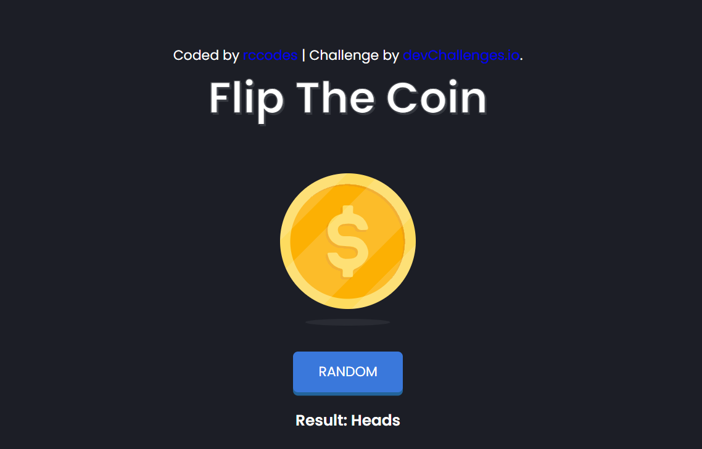

# 🎯 DevChallenges.io - Flip The Coin

 <!-- Replace with actual screenshot filename in your /images folder -->

## 👋 Welcome!

Welcome to the **Flip The Coin** responsive web project, built as part of the [devChallenges.io](https://devchallenges.io/) coding challenges. This project helps improve core web development skills through HTML, CSS, and JavaScript.

---

## 🚀 Live Demo

🔗 [View Live Website](https://rohan-rccodes.github.io/flip-the-coin/)  
🛠 Built by: **Rohan Chauhan**  
🎓 BCA Graduate | Web Developer | UI/UX Enthusiast

---

## 🧠 Project Overview

A simple coin-flipping game where users can:

- Click the **Flip Coin** button
- Watch the coin flip (Heads or Tails)
- View the result with visuals and smooth animations
- Enjoy responsiveness across desktop, tablet, and mobile devices

---

## 📦 Features

- Responsive Design (mobile-first)
- Coin flip logic with random results
- Smooth transitions for image and text
- Local SVG graphics for heads, tails, and shadow
- Button press animations for better user interaction

---

## 🧩 Tech Stack

- **HTML5** - Semantic structure
- **CSS3** - Flexbox, transitions, responsiveness
- **JavaScript** - Event handling, randomization logic
- **SVGs** - Used for visuals (`heads.svg`, `tails.svg`, `shadow.svg`)

---

## 🖼 Screenshots

| Coin Flipping | Heads | Tails |
|---------------|-------|-------|
|  |  |  |

---

## 🛠 How to Run Locally

1. Clone the repository:
   bash
   git clone https://github.com/rohan-rccodes/flip-the-coin.git

2. Navigate into the folder:

   cd flip-the-coin

3. Open index.html in your browser.

   open index.html  # or double-click on it

📱 Responsiveness

    ✅ Desktop (≥1280px)

    ✅ Tablet (≥768px)

    ✅ Mobile (≥375px)

📡 Deployment
   This project is deployed using:

    ✅ GitHub Pages: flip-the-coin

    Can also be hosted on Netlify, Vercel, etc.

